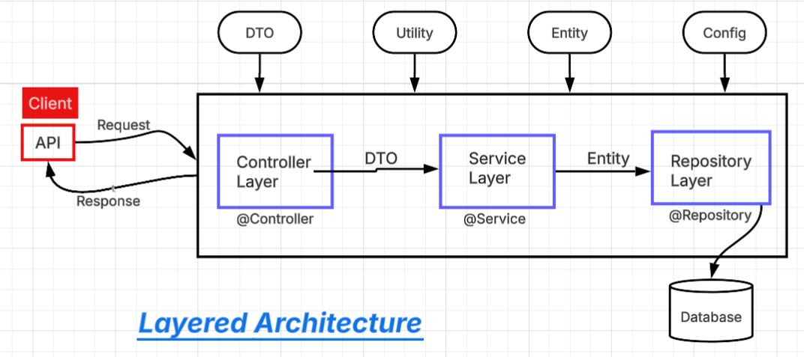
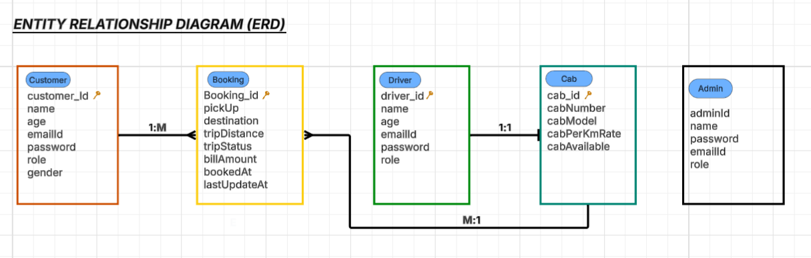
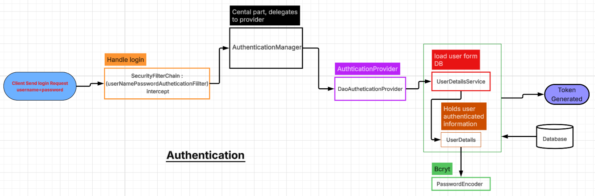
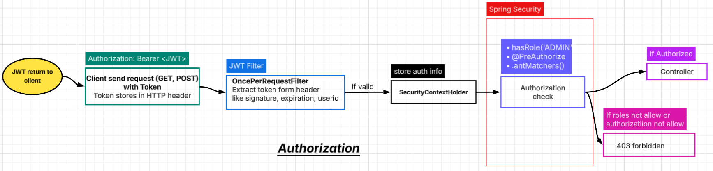
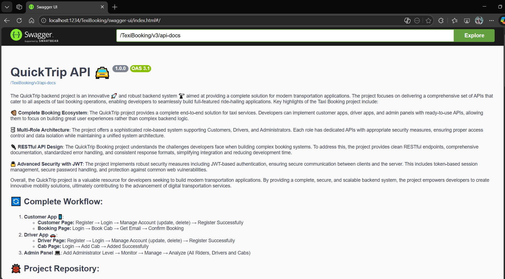

# 🚗 Quick Trip

A QuickTrip backend system similar to Uber/Ola 🚕 enabling cab bookings 📳, customer account management, and driver operations 🚔, with an admin panel for overseeing all users and cabs. Secured with JWT-based authentication 🔐 and role-based access control (RBAC), the project was built with Spring Boot and exposes 15+ REST APIs for all operations. It leverages Spring Data JPA for database interactions with MySQL ♻ and integrates Spring Mail 📩 to automatically send booking confirmation emails to customers. The entire API suite is thoroughly documented with Swagger 📰 for seamless testing and integration.

# ⚛ Architecture

Layered architecture is a design pattern where the application is divided into logical layers, and each layer has a specific responsibility. Each layer communicates only with the layer below it, not directly with other layers. The project follows layered architecture. The Controller layer handles HTTP requests, the Service layer contains business logic, and the Repository layer interacts with the database. Each layer has a single responsibility, which improves maintainability and scalability.”



# 💹 Entity Relationship

Project designed the database using an Entity Relationship model. Customer, Driver, Cab, and Booking are the core entities. A customer can have multiple bookings, each booking is associated with one driver and one cab, and a driver is linked to a single cab. Relationships are implemented using JPA annotations like @OneToMany and @ManyToOne.”




## 💥 All Documented API's

#### 🔐 Login API 

```http
  POST /auth/login
```


#### 👩‍👦 Customer API's

```http
  POST /customer/add
  GET /customer/get/profile-id/{emailId}
  GET /customer/get/All
  GET /customer/get/adult/
  UPDATE /customer/update
  DELETE /customer/delete/{emailId}
```


#### 🕺 Driver API's

```http
  POST /driver/add
  GET /driver/get/profile-id/{emailId}
  GET /driver/get/All
  UPDATE /driver/update
  DELETE /driver/delete/{emailId}
```


#### ✔ Booking API's

```http
  POST /booking/book/customer-id/{customerId}
  POST /booking/complete/driver/booking-id/{bookingId}
  POST /booking/cancel/customer/booking-id/{bookingId}
```


#### 🚖 Cab API's

```http
  POST /cab/register/driver-id/{driverId}
  GET /cab/get/cab-id/{cabId}
  GET /cab/get/all
```
## 🔄 Project Complete Workflow

**Customer Screen: 📱**  
- Add Rider ➡ Register Successfully 
- Login ➡ Get token (if authorized) ➡ Add token ➡ Manage Account such as update, delete etc

**Driver Screen: 📱**  
- Add Driver ➡ Register Successfully
- Login ➡ Get token (if authorized) ➡ Add Token ➡ Manage Account such as update, delete etc 

**Add Cab: 📱**  
- Login Driver ➡ Get token (if authorized) ➡ Add Token ➡ Add Cab with all necessary information ➡ Cab added successfully

**Book Cab: 📱**  
- Login Rider ➡ Get token (if authorized) ➡ Add Token ➡ Book Cab ➡ Booking successfully
- Login Rider ➡ Get token (if authorized) ➡ Add Token ➡ Cencel Cab  ➡ Cancel successfully


**When ride is completed: 📱**  
- Take booking id from rider  ➡  Insert Driver screen ➡ Ride  completed 


## 🔐 Security Feature

The most important model for securing the project is ***Spring Security***. Only Spring Security is not enough, so implement with ***JWT (JSON Web Token).***

***Authentication***



***Authorization***



**Authentication flow for different roles:**


## 👀 Screenshots

**Description of the project:**




**All APIs:**


**Login APIs:**


**Cab APIs:**


**JWT Token:**


**Token authorization:**


**Request JSON payload:**


**Response JSON payload:**


**All Service classes:**


## 🕹 Technologies Used

**Spring Boot:** Rest APIs, Spring Data JPA, Spring Security Spring Mail etc

**Database:** MySQL

**Other:** Swagger Documentation, JWT token, Apache Tomcat


## ⏳ Pre-requisites:

Before running the project, make sure you have the following knowledge:

👩‍💻 Java 17+

🧠 Spring ecosytem (Spring Boot, Rest APIs, Spring Data JPA, Spring Security etc)

⚠ Spring security with JWT authetication and autherization

🎉 IDE (Spring Tool Suit, Eclipse, IntelliJ IDEA or any preferred IDE)

👯‍♀️ MySQL Database (for store all customer, driver, cab and booking info.)

🤔 Maven (for dependency management)

🎀 Swagger for documentation

✅ Lombok (for shorter code but with Annotation)

🔰 Devtool (for auto deployment)


## 🔗 Links
[](https://github.com/IamPawan777)

[](https://www.linkedin.com/in/pawan-bisht-a0578b201/)


## Have a safe journey! 😎


